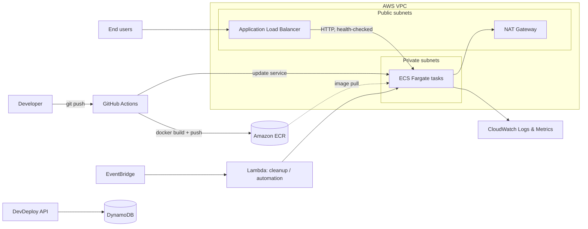

# DevDeploy

Self-service deployment platform that takes a GitHub repository to a running containerized app on AWS: build with GitHub Actions, push to Amazon ECR, deploy to ECS Fargate behind an Application Load Balancer. Includes a web dashboard, deployment tracking, and automatic cleanup.

## Features

- GitHub repository integration
- Declarative config via `devdeploy.yml`
- Automated build and deploy with GitHub Actions
- Docker image builds published to Amazon ECR
- ECS Fargate deployments behind an ALB
- Deployment orchestration and status tracking
- Auto-destroy / cleanup workflows
- Next.js dashboard for apps and deployments
- Auth, validation, and secured API middleware
- CloudWatch observability
- Infrastructure as code with Terraform

## Architecture



| Layer | Technology |
|-------|------------|
| Frontend | Next.js, React, TypeScript, Tailwind CSS |
| Backend | Node.js, Express, TypeScript |
| Infrastructure | AWS, Terraform |
| CI/CD | GitHub Actions, Docker |
| Database | DynamoDB |
| Runtime | ECS Fargate (private subnets) |
| Registry | ECR |
| Load balancing | ALB (public subnets) |
| Automation | EventBridge, Lambda |
| Monitoring | CloudWatch, CloudWatch Logs |

## Quick Start (local)

Prerequisites: Docker with Compose v2.

```bash
git clone https://github.com/Parshant1231/dev_deploy.git
cd dev_deploy
docker compose up
```

- Dashboard: http://localhost:3000
- API: http://localhost:8080 *(adjust to your compose port mapping)*

No `.env` editing is required for local development. Compose ships with non-secret local defaults. Real credentials are never stored in the repo (see [Security](#security)).

## Production Deployment Verification

Zero-downtime is achieved with ECS rolling deployments: `minimumHealthyPercent = 100`, `maximumPercent = 200`, ALB health checks gating traffic to new tasks, and the deployment circuit breaker with rollback enabled.

Verify it yourself during any rollout:

**1. Start a continuous health probe (terminal A):**

```bash
while true; do
  printf '%s  ' "$(date +%T)"
  curl -s -o /dev/null -w '%{http_code}  %{time_total}s\n' \
    https://<YOUR_ALB_DNS_OR_DOMAIN>/health
  sleep 0.5
done
```

**2. Trigger a deployment (terminal B):**

```bash
aws ecs update-service \
  --cluster <CLUSTER_NAME> \
  --service <SERVICE_NAME> \
  --force-new-deployment
```

**3. Watch the rollout converge:**

```bash
aws ecs describe-services \
  --cluster <CLUSTER_NAME> --services <SERVICE_NAME> \
  --query 'services[0].deployments[].{status:status,running:runningCount,desired:desiredCount,rollout:rolloutState}'
```

**Pass criteria:** terminal A shows only `200` for the full rollout (no `502`/`503`/connection errors), and `rolloutState` reaches `COMPLETED`.

## 60-Second Rollback

Every image is tagged with its commit SHA, so any previous release can be redeployed immediately.

**Option A: CLI (about 30–60 seconds)**

```bash
# 1. List recent task definition revisions
aws ecs list-task-definitions --family-prefix <TASK_FAMILY> --sort DESC --max-items 5

# 2. Point the service at the previous revision
aws ecs update-service \
  --cluster <CLUSTER_NAME> \
  --service <SERVICE_NAME> \
  --task-definition <TASK_FAMILY>:<PREVIOUS_REVISION>
```

**Option B: GitHub Actions UI**

1. Go to **Actions → Deploy** workflow.
2. Open the last known-good successful run.
3. Click **Re-run all jobs**. This redeploys that run's exact image tag.

Automatic rollback also triggers if the ECS deployment circuit breaker detects failing tasks.

## How It Works

1. User connects a GitHub repo in the dashboard.
2. DevDeploy reads and validates `devdeploy.yml`.
3. GitHub Actions builds the container image.
4. Image is pushed to ECR, tagged with the commit SHA.
5. DevDeploy provisions or updates the ECS service and task definition.
6. Tasks run in private subnets and receive traffic through the public ALB.
7. State, logs, and events are recorded for monitoring.
8. Cleanup workflows remove temporary or inactive resources.

## Project Structure

```text
.
├── apps/
│   ├── backend/             # Express API and deployment services
│   ├── frontend/            # Next.js dashboard
│   └── sample-app/          # Sample app for deployment testing
├── infrastructure/
│   ├── lambda/              # Platform automation functions
│   └── terraform/
│       ├── bootstrap/
│       ├── environments/
│       └── modules/
├── .github/workflows/       # Backend and user-app deployment workflows
├── docs/architecture/       # Specs and design docs
├── docker-compose.yml       # Local development stack
└── .env.example             # Variable names only, no values
```

## Infrastructure

Terraform modules cover networking, security, storage, compute, Lambda automation, and monitoring.

```bash
cd infrastructure/terraform/environments/<ENV>
terraform init
terraform plan
terraform apply
```

Review the target environment, region, and remote state backend before applying.

## Application Configuration

Apps describe build and runtime needs in `devdeploy.yml`. Full spec: [`docs/architecture/DEVDEPLOY_YML_SPEC.md`](docs/architecture/DEVDEPLOY_YML_SPEC.md).

## Security

- No secrets in the repo or git history. CI uses GitHub OIDC to assume an AWS role (no long-lived keys).
- Runtime secrets live in AWS Secrets Manager / SSM Parameter Store.
- Least-privilege IAM for AWS and GitHub integrations.
- ECS tasks run in private subnets; only the ALB is internet-facing.
- Review every Terraform plan before applying.
- Rotate any credential immediately if exposed.

## Development Status

All 10 planned phases (foundation, Terraform, backend, GitHub/CI/CD, container platform, orchestrator, auto-destroy, dashboard, observability, security hardening) are complete.

## License

MIT. See [LICENSE](LICENSE).
